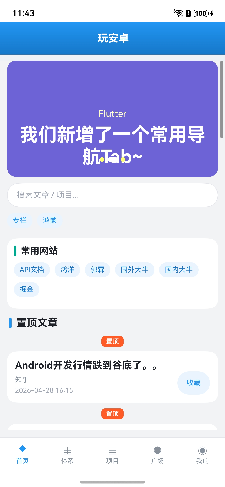
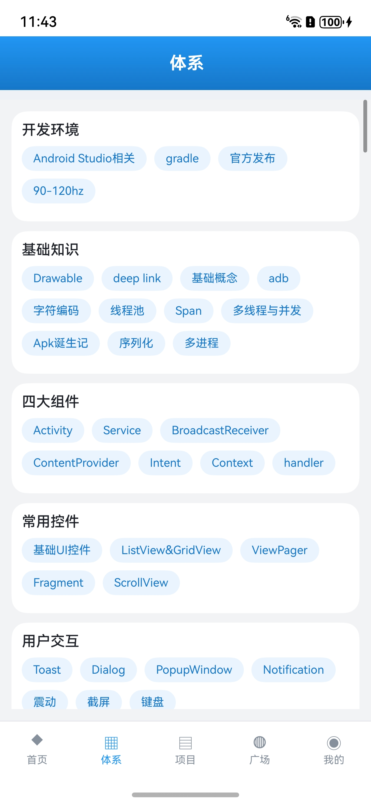
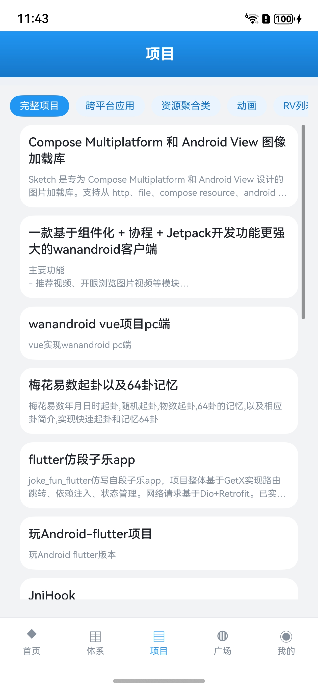
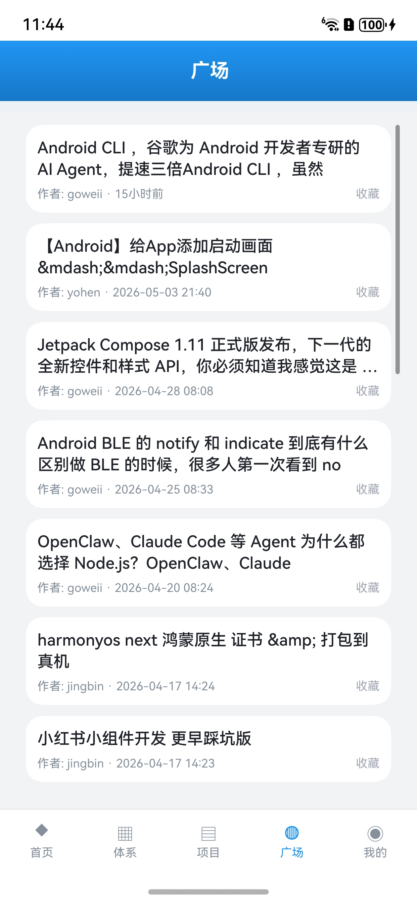
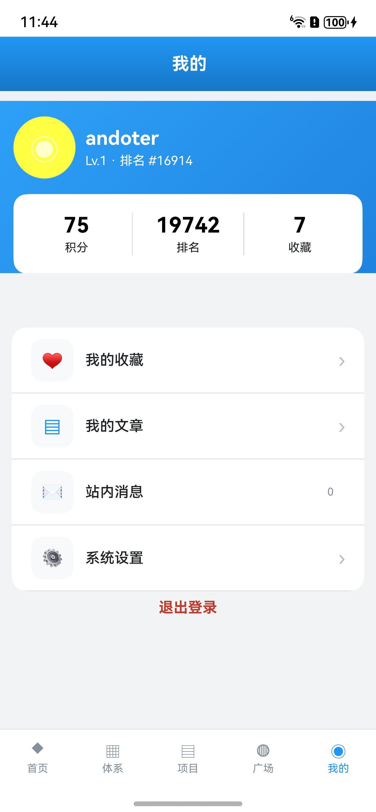
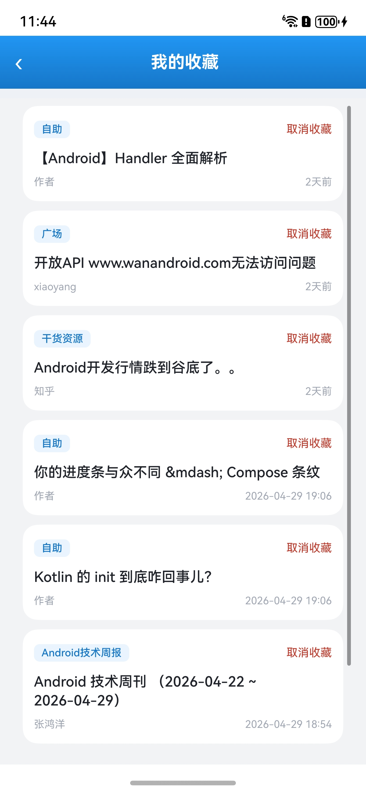
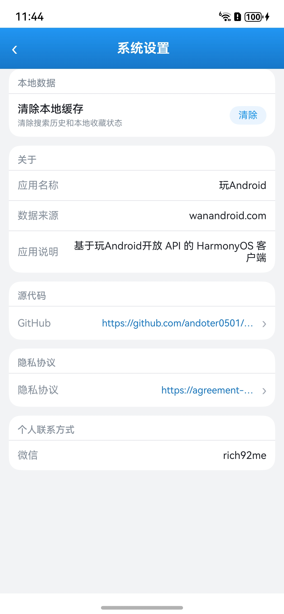

# 玩Android HarmonyOS 客户端

基于 [WanAndroid](https://www.wanandroid.com) 开放 API 开发的 HarmonyOS 手机端内容客户端，使用 ArkTS / ArkUI 实现。项目覆盖技术文章浏览、体系分类、项目、广场、搜索、登录、收藏、个人中心和系统设置等常用功能。

## 功能特性

- 首页：Banner、置顶文章、文章流、常用网站入口。
- 分类：体系二级分类文章列表、项目分类与项目列表。
- 内容：广场、问答、用户分享文章、Web 详情页。
- 搜索：热词、搜索历史、搜索结果分页。
- 账号：登录、注册、Cookie 会话恢复、登录失效处理。
- 收藏：文章收藏、取消收藏、我的收藏列表、本地收藏状态同步。
- 我的：积分、排名、收藏数、站内消息数量、系统设置。
- 系统设置：清除本地缓存、关于、源代码地址、隐私协议、联系方式。
- 体验：列表分页、下拉刷新、Tab 页面缓存、URL 安全拦截。

## 运行效果

<table>
  <tr>
    <td align="center"><br />首页</td>
    <td align="center"><br />体系</td>
    <td align="center"><br />项目</td>
  </tr>
  <tr>
    <td align="center"><br />广场</td>
    <td align="center"><br />我的</td>
    <td align="center"><br />我的收藏</td>
  </tr>
  <tr>
    <td align="center"><br />系统设置</td>
  </tr>
</table>

## 技术栈

- HarmonyOS
- ArkTS / ArkUI
- hvigor 构建
- WanAndroid Open API
- Cookie 会话持久化
- 本地轻量缓存

## 目录结构

```text
entry/src/main/ets/
  app/                 # 应用壳、Tab 导航、页面切换
  common/              # 网络、缓存、收藏状态、通用 UI、Web 安全
  features/            # 业务功能模块
    auth/              # 登录注册
    collect/           # 我的收藏
    home/              # 首页
    know/              # 体系
    project/           # 项目
    plaza/             # 广场
    search/            # 搜索
    settings/          # 系统设置
    mine/              # 我的
    web/               # Web 详情
doc/                   # 接口文档、经验总结、预览资源
docs/                  # 架构、计划、测试与交付文档
```

## 快速开始

1. 使用 DevEco Studio 打开仓库根目录。
2. 等待 IDE 同步工程依赖。
3. 检查签名配置，按需要补齐 `build-profile.json5` 中的签名信息。
4. 通过 DevEco Studio 执行 `Build > Build Hap(s)`。
5. 安装到真机或模拟器后验证首页、搜索、登录、收藏、我的等核心流程。

## CLI 构建

在本机 DevEco Studio 安装路径一致时，可以使用下面命令构建 HAP：

```shell
DEVECO_SDK_HOME=/Applications/DevEco-Studio.app/Contents/sdk \
/Applications/DevEco-Studio.app/Contents/tools/node/bin/node \
/Applications/DevEco-Studio.app/Contents/tools/hvigor/bin/hvigorw.js \
--mode module \
-p module=entry@default \
-p product=default \
-p requiredDeviceType=phone \
assembleHap \
--analyze=normal \
--parallel \
--incremental \
--daemon
```

如果本机 DevEco Studio 安装路径不同，需要相应调整 `DEVECO_SDK_HOME`、`node` 和 `hvigorw.js` 路径。

## 相关文档

- [WanAndroid 接口详情文档](doc/wanAndroid%20接口详情文档.md)
- [接口映射与架构草案](docs/architecture/2026-04-25-wanandroid-harmony-api-architecture.md)
- [Harmony 完整构建链路](docs/tests/harmony-build-pipeline.md)
- [发布质量检查清单](docs/tests/release-quality-checklist.md)
- [项目开发经验总结](doc/项目开发经验总结.md)

## 开发注意事项

- ArkTS 代码避免使用 `any` / `unknown`，优先定义明确接口。
- 修改 UI 或数据模型后，建议执行一次 `assembleHap` 验证。
- 网络响应统一按 `errorCode` 判断，`-1001` 表示登录失效。
- Tab 页面采用访问后缓存挂载，避免切换 Tab 时重复请求网络。
- `.appanalyzer/`、`.hvigor/`、`.idea/`、`entry/build/`、`publishkey/` 不进入版本管理。

## 源代码与隐私协议

- 源代码：https://github.com/andoter0501/wanAndroid
- 隐私协议：https://agreement-drcn.hispace.dbankcloud.cn/index.html?lang=zh&agreementId=1944829454714933888
- 联系方式：vx: rich92me

## 数据来源

本项目数据来自 [WanAndroid](https://www.wanandroid.com) 开放 API。接口版权和内容归原站点及原作者所有。
