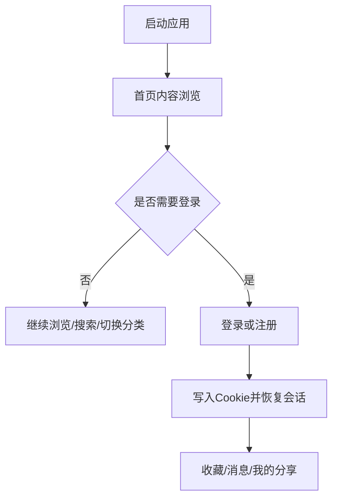
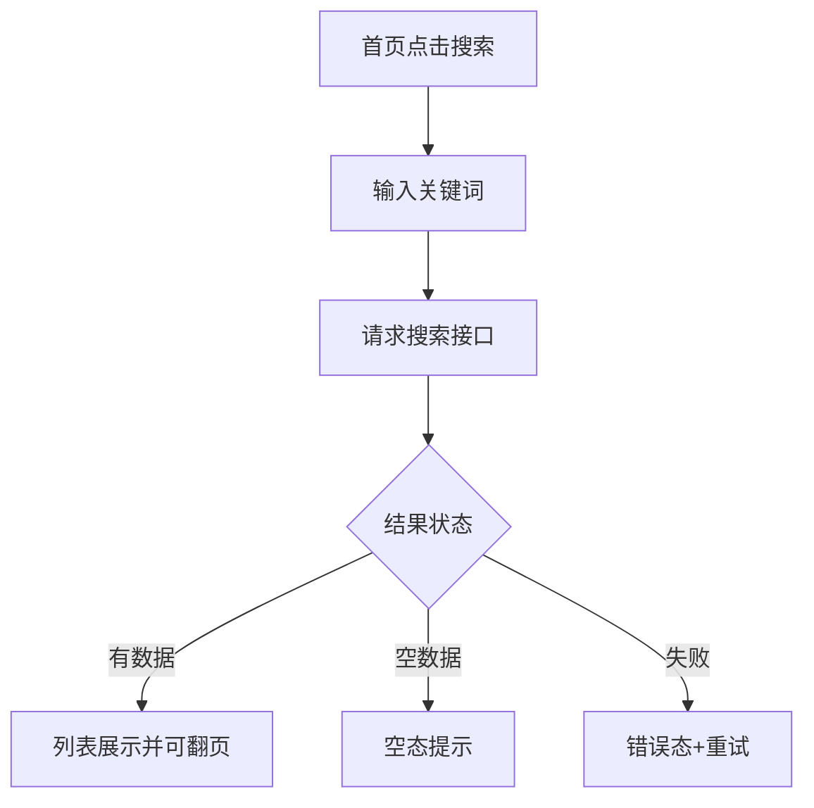

# wanAndroid 鸿蒙客户端 UI 原型稿（手机端）

## 1. 信息架构（IA）

底部一级导航（5 Tab）：
- 首页
- 发现
- 广场
- 问答
- 我的

辅助全局入口：
- 搜索（首页右上角）
- 消息（我的页入口）
- 登录态引导（收藏/我的分享等受限功能触发）

## 2. 页面清单

### 首页
- 顶部：Logo + 搜索入口。
- 区块顺序：
1. Banner
2. 置顶文章（横向小卡）
3. 热门板块（问答/专栏/路线）
4. 鸿蒙专栏入口
5. 首页文章流（分页）

### 发现
- 顶部二级 Tab：体系 / 导航 / 项目。
- 体系：一级分类 + 二级分类入口，跳转文章列表。
- 导航：按分组展示站点卡片。
- 项目：项目分类横向 Tab + 项目列表分页。

### 广场
- 广场文章列表（分页）。
- 文章项支持：进入详情、进入分享人主页。
- 登录后可用：我的分享列表、发布分享、删除自己的分享。

### 问答
- 问答列表（分页）。
- 问答详情页：评论列表（默认按点赞倒序）。

### 我的
- 未登录：登录/注册引导卡。
- 已登录：
1. 用户信息卡（昵称、等级、排名、积分）
2. 我的收藏
3. 收藏网站
4. 我的分享
5. 站内消息（未读角标）
6. 退出登录

### 搜索
- 热词区 + 搜索输入框 + 历史词。
- 搜索结果列表（分页）。

## 3. 关键用户流





## 4. 低保真线框（文本）

### 首页线框
```text
+--------------------------------------------------+
| wanAndroid                        [搜索]         |
| [ Banner Carousel ............. ]                |
| 置顶: [Top1] [Top2] [Top3]                      |
| 热门: [问答] [专栏] [路线]                        |
| 鸿蒙专栏: [常用链接] [开源项目] [常用工具]         |
| ------------------------------------------------ |
| 文章卡片 #1                                      |
| 标题/作者/分类/时间                               |
| ------------------------------------------------ |
| 文章卡片 #2 ...                                  |
+--------------------------------------------------+
| 首页 | 发现 | 广场 | 问答 | 我的                 |
+--------------------------------------------------+
```

### 我的页线框（登录态）
```text
+--------------------------------------------------+
| 头像 昵称Lv.XX           积分:xxxx  排名:xx      |
| ------------------------------------------------ |
| [我的收藏]                                        |
| [收藏网站]                                        |
| [我的分享]                                        |
| [站内消息]                          未读: 3       |
| [退出登录]                                        |
+--------------------------------------------------+
```

## 5. 中保真交互规则
- 列表统一支持：下拉刷新 + 上拉分页加载。
- 页面切换遵循鸿蒙手势返回与系统转场节奏。
- Web 详情页对恶意跳转做白名单拦截（提升浏览体验）。
- 受限功能点击时，若未登录则弹登录引导而不是直接报错。

## 6. 页面状态规范（每个核心页必须覆盖）
- `Loading`：骨架屏（列表）、占位块（Banner）。
- `Success`：正常内容。
- `Empty`：空图标 + 简短文案 + 主要操作按钮（去首页/去搜索）。
- `Error`：错误文案 + 重试按钮。
- `Offline`：网络不可用提示条，保留本地已渲染内容。
- `AuthExpired(-1001)`：清会话 + 轻提示 + 跳登录页。

## 7. 组件清单（首批）
- `AppTopBar`
- `BottomTabBar`
- `ArticleCard`
- `BannerCarousel`
- `CategoryChip`
- `StateView`（loading/empty/error/offline 统一容器）
- `LoginPromptSheet`
- `CoinInfoCard`
- `MessageBadgeItem`
