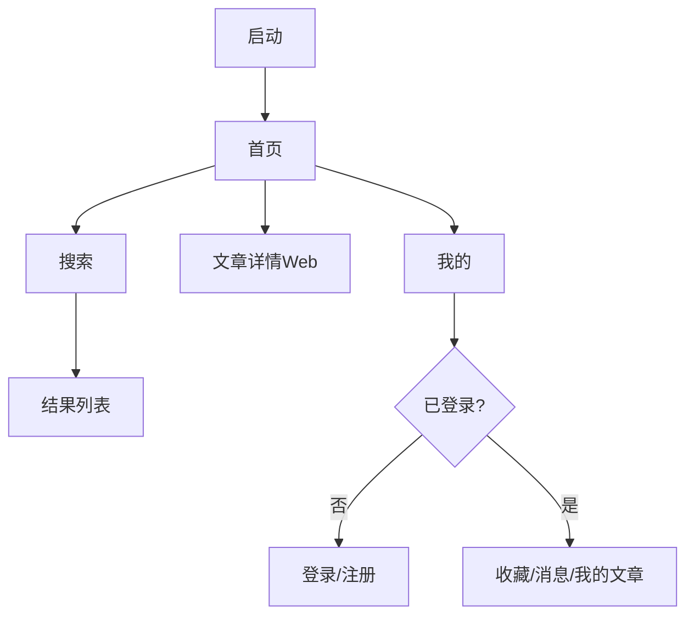

# WanAndroid 鸿蒙 App 原型设计（UIPro 增强版）

## 1. 说明
本稿基于 `ui-ux-pro-max` 技能流程生成，并结合你提供的示例图与接口文档做本地化落地：
- 输入素材：`doc/ui/*.png`
- 接口依据：`doc/wanAndroid 接口详情文档.md`
- 目标：形成可直接给鸿蒙 ArkUI 开发的原型规范

## 2. UIPro 检索结论（已吸收）
- 设计模式：`Community/Forum`（社区内容型产品）
- 风格建议：高识别度、区块化布局、清晰 CTA
- 字体建议：`JetBrains Mono + IBM Plex Sans`
- UX 高优先规则：
1. 错误必须可感知且可恢复（重试/引导）
2. 回退路径必须稳定（系统返回手势 + 历史栈）
3. 空态不可留白（必须给下一步动作）
4. 异步必须有状态反馈（骨架屏/加载态）

注：UIPro 默认推荐了紫色系，但为与现有示例图保持一致，本方案采用蓝色主视觉并保留其信息层级方法。

## 3. 视觉系统（落地版）
- Primary: `#2196F3`
- Primary-Deep: `#1677C8`
- Accent: `#22C55E`
- Danger: `#F53F3F`
- Page BG: `#F2F3F5`
- Card BG: `#FFFFFF`
- Text Main: `#1F2329`
- Text Sub: `#86909C`

圆角与阴影：
- 胶囊输入/标签：`999vp`
- 卡片：`20vp`
- 阴影：`0 6vp 24vp rgba(31,35,41,0.08)`

字体层级：
- H1（页面标题）：`22fp / 600`
- H2（区块标题）：`18fp / 600`
- Body（正文）：`15fp / 400`
- Meta（辅助）：`12fp / 400`

## 4. 原型页面（鸿蒙手机端）

### 4.1 首页
- 结构：TopBar -> Banner -> 搜索入口 -> 置顶文章 -> 普通文章流 -> BottomTab
- 行为：下拉刷新、上拉分页、卡片点击进 WebDetail
- 状态：Loading/Empty/Error/Offline

### 4.2 搜索
- 结构：搜索输入 + 历史词 + 热门词 + 常用网站
- 行为：
1. 回车触发搜索
2. 历史词可删除/清空
3. 无结果时给推荐关键词

### 4.3 体系
- 结构：一级类目折叠 + 二级标签流
- 行为：点击二级标签进入分类文章列表

### 4.4 项目
- 结构：横向分类 Tab + 列表流
- 行为：切换 Tab 保留滚动位置与缓存

### 4.5 广场（问答）
- 结构：问答卡片流
- 行为：作者可跳用户页；受限操作触发登录引导

### 4.6 我的
- 结构：蓝色用户头部 + 数据卡 + 菜单列表 + 退出登录
- 菜单：我的收藏、我的文章、TODO、站内消息、设置
- 行为：未登录态显示登录卡；消息展示未读角标

### 4.7 登录/注册
- 结构：账号输入、密码输入、登录、注册跳转
- UX 约束：错误信息就近显示在对应输入框下方

### 4.8 收藏
- 结构：收藏文章分页流
- 行为：左滑取消收藏

## 5. 关键流程

## 6. 接口映射
- `GET /banner/json` Banner
- `GET /article/top/json` 置顶
- `GET /article/list/{page}/json` 首页列表
- `GET /hotkey/json` 热词
- `POST /article/query/{page}/json` 搜索
- `GET /tree/json` 体系
- `GET /article/list/{page}/json?cid={cid}` 体系文章
- `GET /project/tree/json` 项目分类
- `GET /project/list/{page}/json?cid={cid}` 项目列表
- `GET /wenda/list/{page}/json` 问答
- `GET /lg/collect/list/{page}/json` 收藏
- `POST /user/login` 登录
- `POST /user/register` 注册
- `GET /user/logout/json` 退出

## 7. ArkUI 组件清单
- `AppTopBar`
- `BottomTabBar`
- `BannerCarousel`
- `SearchCapsule`
- `ArticleCard`
- `ProfileHeaderCard`
- `ProfileMenuList`
- `StateView`
- `LoginPromptSheet`

## 8. UIPro 质量门槛（验收）
1. 所有可点击元素有点击反馈与可见焦点态
2. 所有异步请求有加载态，不允许空白等待
3. 所有错误态有恢复操作（重试/返回/登录）
4. 空态必须有下一步动作按钮
5. 页面返回路径与系统手势一致，不中断导航栈
