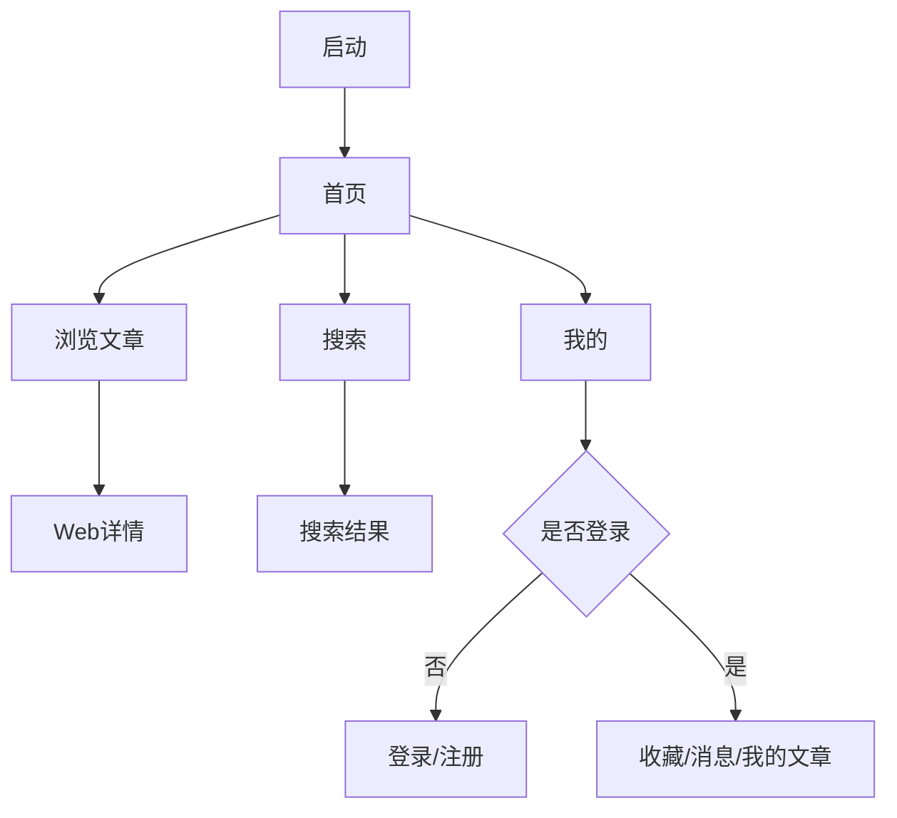

# WanAndroid 鸿蒙 App 原型图设计（V2）

## 1. 设计目标
- 基于示例图（`doc/ui/*.png`）形成统一视觉与交互规范。
- 基于接口文档（`doc/wanAndroid 接口详情文档.md`）保证页面能力可落地。
- 输出可直接给 UI/前端/客户端协作的原型级说明。

## 2. 视觉方向（与示例图对齐）
- 主色：`#2196F3`（标题栏、激活态、强调图标）
- 辅色：`#F2F3F5`（页面背景）
- 卡片：`#FFFFFF` + 圆角 `20vp` + 阴影低强度
- 文本：
  - 主文案 `#1F2329`
  - 次文案 `#86909C`
  - 危险操作 `#F53F3F`
- 圆角体系：
  - 搜索框/标签 `999vp`（胶囊）
  - 列表卡片 `16~20vp`
- 动效：
  - 页面入场：`240ms` 渐入上滑
  - 卡片点击：`90ms` 缩放反馈（0.98）

## 3. 信息架构（IA）
底部导航（固定 5 Tab）：
1. 首页
2. 体系
3. 项目
4. 广场（问答）
5. 我的

全局入口：
- 搜索（首页右上角）
- 登录（受限能力触发）
- Web 详情（文章点击进入）

## 4. 页面原型（中保真）

### 4.1 首页 Home
```text
+--------------------------------------------------+
| 顶栏: 标题(玩安卓)                     搜索 主题 |
| Banner 轮播（3~5条）                             |
| 搜索框（点击跳转搜索页）                          |
| 置顶文章卡（Top 3）                               |
| 普通文章流（分页）                                |
| [悬浮按钮 +]（可配置：回到顶部/快捷发布）         |
+--------------------------------------------------+
| 首页 | 体系 | 项目 | 广场 | 我的                  |
+--------------------------------------------------+
```
交互：
- 下拉刷新：banner + top + list 同步刷新。
- 上拉加载：文章列表分页。
- 点击卡片：进入 WebDetail。

### 4.2 搜索 Search
```text
+--------------------------------------------------+
| 顶栏: 搜索                                        |
| 输入框 [搜索文章/项目]      [取消]                |
| 搜索历史: chip 列表                               |
| 热门搜索: chip 列表                               |
| 常用网站: 两列卡片（官方文档/社区等）             |
+--------------------------------------------------+
```
交互：
- 回车/点击历史词执行搜索。
- 左滑历史词可删除，支持“一键清空历史”。

### 4.3 体系 Know
```text
+--------------------------------------------------+
| 顶栏: 体系                                        |
| 一级分类（可折叠）                                |
| 二级标签流（点击进入文章列表）                    |
+--------------------------------------------------+
```
交互：
- 点击二级分类打开“分类文章列表页（带标题）”。

### 4.4 项目 Project
```text
+--------------------------------------------------+
| 顶栏: 项目                                        |
| 分类 Tab（横向可滚动）                            |
| 项目文章列表（分页）                              |
+--------------------------------------------------+
```
交互：
- 切换 Tab 时保留各 Tab 滚动位置与缓存。

### 4.5 广场 / 问答 Plaza
```text
+--------------------------------------------------+
| 顶栏: 广场                                        |
| 问答/分享列表（分页）                             |
| 卡片元素: 标题、作者、时间、标签、评论数           |
+--------------------------------------------------+
```
交互：
- 作者名点击进入“用户分享页”。
- 未登录点击“我的分享/发布”时弹登录引导。

### 4.6 我的 Profile
```text
+--------------------------------------------------+
| 头部蓝色信息区: 头像 昵称 Lv 排名                 |
| 数据卡: 积分 | 排名 | 收藏                         |
| 菜单: 我的收藏 / 我的文章 / TODO / 站内消息 / 设置 |
| 底部: 退出登录（红字）                            |
+--------------------------------------------------+
```
交互：
- 未登录态显示“登录/注册”按钮卡。
- 站内消息显示未读角标。

### 4.7 登录 / 注册
```text
+--------------------------------------------------+
| Logo + 标题                                       |
| 用户名输入框                                      |
| 密码输入框                                        |
| [登录]  [去注册]                                  |
+--------------------------------------------------+
```
交互：
- 登录成功后回到触发页并恢复原操作。

### 4.8 收藏页 Collect
```text
+--------------------------------------------------+
| 顶栏: 我的收藏                                    |
| 收藏文章列表（分页）                              |
| 左滑操作: 取消收藏                                |
+--------------------------------------------------+
```

## 5. 关键流程（Mermaid）


## 6. 页面状态规范
每个核心页必须包含：
- Loading：骨架屏
- Success：正常数据
- Empty：空态图 + 文案 + 主按钮
- Error：错误文案 + 重试
- AuthExpired（`errorCode=-1001`）：清会话并跳登录
- Offline：弱网提示条 + 保留旧内容

## 7. 接口映射（核心）
- 首页文章：`GET /article/list/{page}/json`
- 首页 Banner：`GET /banner/json`
- 置顶文章：`GET /article/top/json`
- 热词：`GET /hotkey/json`
- 搜索：`POST /article/query/{page}/json`
- 体系：`GET /tree/json`
- 体系文章：`GET /article/list/{page}/json?cid={cid}`
- 项目分类：`GET /project/tree/json`
- 项目列表：`GET /project/list/{page}/json?cid={cid}`
- 问答列表：`GET /wenda/list/{page}/json`
- 收藏列表：`GET /lg/collect/list/{page}/json`
- 登录：`POST /user/login`
- 注册：`POST /user/register`
- 退出：`GET /user/logout/json`

## 8. 组件拆分建议（鸿蒙 ArkUI）
- `AppTopBar`
- `BottomTabBar`
- `BannerCarousel`
- `SearchCapsule`
- `ArticleCard`
- `ProfileHeaderCard`
- `ProfileMenuList`
- `StateView`（loading/empty/error/offline）
- `LoginPromptSheet`

## 9. 交付建议
- 原型优先级 P0：Home / Search / Know / Project / Profile / Login。
- P1：Collect / Message / UserShare。
- P2：主题切换、手势增强、细节动画。
